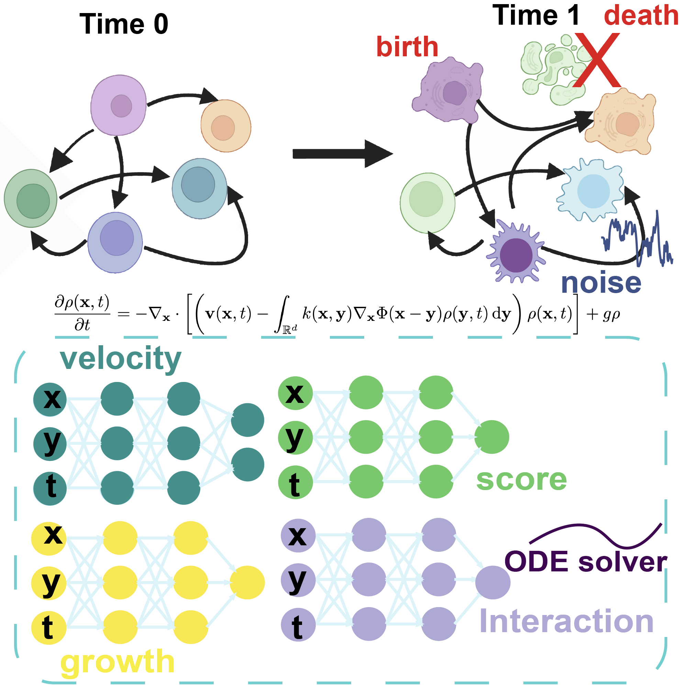

<h1 align="center">Modeling Cell Dynamics and Interactions with Unbalanced Mean Field Schrödinger Bridge (NeurIPS 2025)</h1>

<div align="center">

[](https://arxiv.org/pdf/2505.11197)

</div>


## Introduction
Modeling the dynamics from sparsely time-resolved snapshot data is crucial for understanding complex cellular processes and behavior. Existing methods leverage optimal transport, Schrödinger bridge theory, or their variants to simultaneously infer stochastic, unbalanced dynamics from snapshot data. However, these approaches remain limited in their ability to account for cell-cell interactions. This integration is essential in real-world scenarios since intercellular communications are fundamental life processes and can influence cell state-transition dynamics. To address this challenge, we formulate the Unbalanced Mean-Field Schrödinger Bridge (UMFSB) framework to model unbalanced stochastic interaction dynamics from snapshot data. Inspired by this framework, we further propose **CytoBridge**, a deep learning algorithm designed to approximate the UMFSB problem. By explicitly modeling cellular transitions, proliferation, and interactions through neural networks, CytoBridge offers the flexibility to learn these processes directly from data. The effectiveness of our method has been extensively validated using both synthetic gene regulatory data and real scRNA-seq datasets. Compared to existing methods, CytoBridge identifies growth, transition, and interaction patterns, eliminates false transitions, and reconstructs the developmental landscape with greater accuracy.

<p align="center">
  
</p>

## Environment Setup

It is recommended to use conda for environment management.

Create and activate a new environment:

```bash
conda env create -f environment.yml
conda activate CytoBridge
```

CytoBridge has been tested on Linux systems with CUDA available.

## Running Training Scripts

All training scripts are located in the `training/` folder. You can run different scripts depending on your dataset or task.

### Example

To reproduce our results on synthetic gene dataset with attractive interactions, simply run `train_simulation.py`:

```bash
cd training
python train_simulation.py
```

Other available training scripts:
- EMT: `train_emt.py`
- Mouse Hematopoiesis: `train_mouse.py`
- Pancreatic β-cell differentiation: `train_veres.py`
- Embryoid body: `train_eb.py`
- Zebrafish: `train_zebrafish.py`

You can run them in a similar way:

```bash
cd training
python <script_name>.py
```

We also provide trained checkpoints on these datasets in the `checkpoints/` folder

## Future Development
Please be aware that the functionality of this repository is scheduled to be merged into [CytoBridge](https://github.com/zhenyiizhang/CytoBridge), a comprehensive and user-friendly toolkit for dynamical optimal transport that we are actively developing. We recommend keeping an eye on the project for future updates. To use CytoBridge without cell-cell interactions, please check out [DeepRUOTv2](https://github.com/zhenyiizhang/DeepRUOTv2) 

## Citation
If you find CytoBridge useful in your research, please consider citing our work.
<details>
<summary>
Zhenyi Zhang, Zihan Wang, Yuhao Sun, Tiejun Li, and Peijie Zhou. “Modeling Cell Dynamics and Interactions with Unbalanced Mean Field Schrödinger Bridge”. In: The Thirty-ninth Annual Conference on Neural Information Processing Systems, 2025.
</summary>

```bibtex
@inproceedings{
zhang2025modeling,
title={Modeling Cell Dynamics and Interactions with Unbalanced Mean Field Schrödinger Bridge},
author={Zhenyi Zhang, Zihan Wang, Yuhao Sun, Tiejun Li, and Peijie Zhou},
booktitle={The Thirty-ninth Annual Conference on Neural Information Processing Systems},
year={2025},
url={https://openreview.net/forum?id=Z6DJJIN8IJ}
}
```
</details>
